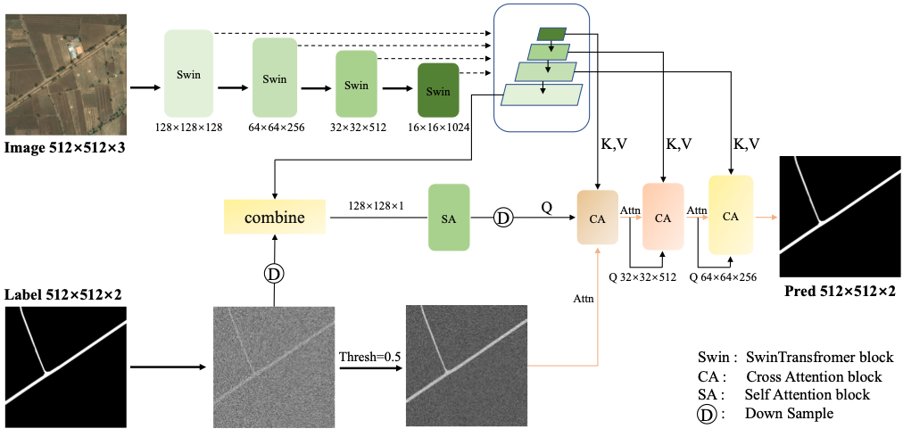

# DiffRoad: A Conditional Diffusion-Based Network for Accurate Road Extraction

Zhengbo Yu, Zhe Chen, Yin Chen, Xiangqi Lei, Qiaoran He, Ruichun Chang, Zhongchang Sun, Keyan Xiao, Huadong Guo
<td align="center">Under Review</td>


## Abstract
We propose a simple, efficient, and effective framework named DiffRoad for road extraction, based on a conditional diffusion pipeline. Unlike conventional road extraction algorithms that require separating roads from complex backgrounds, DiffRoad leverages learned remote sensing image features to perform denoising on the Noisy Map in a single step, yielding accurate road predictions. We validate DiffRoad using the DeepGlobe, Massachusetts, and CHN6-CUG road datasets. On the CHN6-CUG dataset, DiffRoad achieves an impressive road IoU of 91.09%, representing an improvement of approximately 30% in IoU compared to previous SOTA models. It also attains state-of-the-art road IoU scores of 75.19% and 65.27% on the DeepGlobe and Massachusetts datasets, respectively. These results highlight the potential of DiffRoad for urban development applications. The code will be released at https://github.com/Yu-zhengbo/DiffRoad.


## Installation

See [installation instructions](INSTALL.md).

## Getting Started

### Preparing the Dataset 
```python
DiFFRoad
├──chn6
| ├── annotations
| │   ├── train
| |   |   |── ***.png
| |   |   |── ***.png
| |   |   |── ***.png
| │   └── val
| |       |── ***.png
| |       |── ***.png
| |       |── ***.png
| └── images
|     ├── train
|     |   |── ***.jpg
|     |   |── ***.jpg
|     |   |── ***.jpg
|     └── val
|         |── ***.jpg
|         |── ***.jpg
|         |── ***.jpg
├──deepglobe
| ├── annotations
| │   ├── train
| │   └── val
| └── images
|     ├── train
|     └── val
├─-mass
  ├── annotations
  │   ├── train
  │   └── val
  └── images
      ├── train
      └── val
```


### Training & Evaluation in Command Line

#### Training
````python
# Single-GPU training (recommended)
python train_net.py --config-file configs/ade20k/semantic-segmentation/swin/diffroad_swin_base_384_bs16_80k_res512.yaml --num-gpus 1 SOLVER.IMS_PER_BATCH 9 DATASETS.TRAIN '("chn6_train",)' DATASETS.TEST '("chn6_val",)'
````

````python
# Multi-GPU training
python train_net.py --config-file configs/ade20k/semantic-segmentation/swin/diffroad_swin_base_384_bs16_80k_res512.yaml
--num-gpus 8 SOLVER.IMS_PER_BATCH 9 DATASETS.TRAIN '("chn6_train",)' DATASETS.TEST '("chn6_val",)'
````

#### Evaluation
````python
python train_net.py --config-file configs/ade20k/semantic-segmentation/swin/diffroad_swin_base_384_bs16_80k_res512.yaml --eval-only MODEL.WEIGHTS /path/to/checkpoint_file
````

####  Analyse the model
````python
python tools/analyze_model.py --config-file configs/ade20k/semantic-segmentation/swin/diffroad_swin_base_384_bs16_80k_res512.yaml --tasks flop parameter  --use-fixed-input-size
````


#### Inference with a trained model
````python
python demo/demo.py --config-file configs/ade20k/semantic-segmentation/swin/diffroad_swin_base_384_bs16_80k_res512.yaml --input chn6/images/val --output ./chn6Result --opts MODEL.WEIGHTS path/to/checkpoint.pth MODEL.DEVICE cpu
````

Please see [Getting Started with Detectron2](https://github.com/facebookresearch/detectron2/blob/master/GETTING_STARTED.md) for full usage.


## Model Zoo and Baselines

We provide the baseline results and trained models available for download.

### Panoptic Segmentation

<table><tbody>
<!-- START TABLE -->
<!-- TABLE HEADER -->
<th valign="bottom">Dataset</th>
<th valign="bottom">model</th>
<th valign="bottom">interations</th>

<th valign="bottom">download</th>
<!-- TABLE BODY -->
<!-- ROW: dformer_R50_bs16_50ep -->
<tr>
<td align="center">DeepGlobe</td>
<td align="left"><a href="configs/ade20k/semantic-segmentation/swin/diffroad_swin_base_384_bs16_80k_res512.yaml">DiffRoad</a></td>
<td align="center">80000</td>

<td align="center"><a href="https://pan.baidu.com/s/1E7xx9MqpE1aw4j-70aSMlg?pwd=7ubp">weight</a></td>
</tr>

<tr>
<td align="center">Massachusetts</td>
<td align="left"><a href="configs/ade20k/semantic-segmentation/swin/diffroad_swin_base_384_bs16_80k_res512.yaml">DiffRoad</a></td>
<td align="center">80000</td>

<td align="center"><a href="https://pan.baidu.com/s/1nniHV_j2zDTMCOIWaZkkIw?pwd=qh77">weight</a></td>
</tr>

<tr>
<td align="center">CHN6-CUG</td>
<td align="left"><a href="configs/ade20k/semantic-segmentation/swin/diffroad_swin_base_384_bs16_80k_res512.yaml">DiffRoad</a></td>
<td align="center">80000</td>

<td align="center"><a href="https://pan.baidu.com/s/1rRmHngMrzbxDFHwU5IaHSA?pwd=qm2q">weight</a></td>
</tr>

</table>


## <a name="CitingMask2Former"></a>Citing DiffRoad

AS the paper is under review, we will update the citation information when the paper is accepted. If you use DiffRoad in your research or wish to refer to the baseline results published in the Model Zoo and Baselines, please cite this paper as follows, the code both conducted by Zhengbo Yu.

```
SEG-Road: a segmentation network for road extraction based on transformer and CNN with connectivity structures
```

## Reference

This project is developed with reference to [DFormer](https://github.com/cp3wan/DFormer). We would like to express our gratitude to the authors of DFormer for their contributions, which served as a valuable foundation and inspiration for our work. If you find this project helpful, please also consider citing or exploring the original repository.
